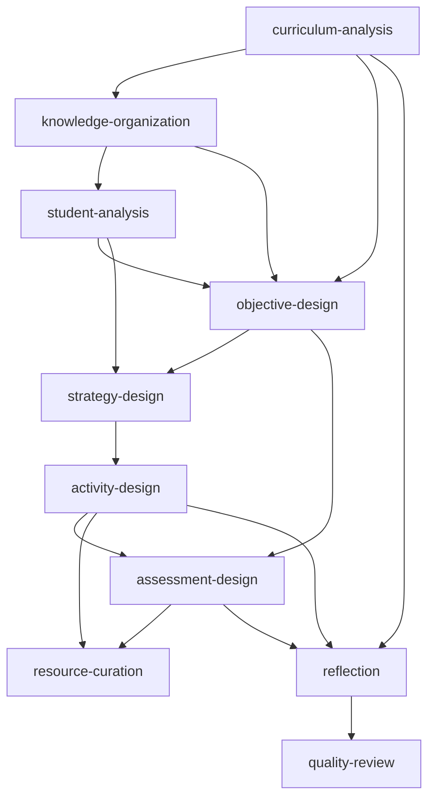

# Capability Specification

## 概述

Capability 是 Skill 提供的可复用能力单元。每个 Capability 定义了输入、输出和执行器，由 Workflow 按需组合调用。

## Capability 结构

```yaml
# capabilities/curriculum-analysis.yaml
id: curriculum-analysis
name: 课程标准分析
description: 解析《普通高中技术与工程课程标准》，提取与当前章节相关的课标要求
type: analysis
version: 1.0.0

input:
  required:
    - subject
    - grade
    - chapter
  optional:
    - textbookVersion
    - knowledgePoints

output:
  fields:
    - name: coursePosition
      type: string
    - name: contentRequirements
      type: array
    - name: coreCompetencies
      type: array
    - name: academicQuality
      type: string
    - name: teachingSuggestions
      type: array

executor:
  expert: curriculum-expert
  prompt: experts/Curriculum_Expert.md
  model: default
  timeout: 30000

dependencies: []

validation:
  required:
    - coursePosition
    - contentRequirements
```

## 7 项核心 Capability

| ID | 名称 | 类型 | Expert | 输出 |
|----|------|------|--------|------|
| `curriculum-analysis` | 课程标准分析 | analysis | Curriculum Expert | 课标要求/核心素养 |
| `knowledge-organization` | 知识体系分析 | analysis | Knowledge Expert | 知识图谱/重难点 |
| `student-analysis` | 学情分析 | analysis | Student Expert | 基础/困难/分层 |
| `objective-design` | 教学目标设计 | design | Goal Expert | 五维教学目标 |
| `strategy-design` | 教学策略设计 | design | Strategy Expert | 方法/模式/策略 |
| `activity-design` | 学习活动设计 | design | Activity Expert | EDP 任务序列 |
| `assessment-design` | 评价方案设计 | design | Assessment Expert | Rubric/证据 |
| `resource-curation` | 教学资源整合 | curation | Resource Expert | 素材/PPT/板书 |
| `reflection` | 教学反思设计 | analysis | Reflection Expert | 反思框架/改进 |
| `quality-review` | 教学质量审核 | review | Review Expert | 评分/建议/发布 |

## Capability 类型

| 类型 | 说明 | 示例 |
|------|------|------|
| `analysis` | 分析型，输入→分析→结构化输出 | 课标分析、学情分析 |
| `design` | 设计型，基于前置分析产出方案 | 目标设计、活动设计 |
| `generation` | 生成型，汇总所有输出生成最终产品 | 完整教学设计 |
| `curation` | 整合理，收集和整合资源 | 资源整合 |
| `review` | 审核型，评估和给出改进建议 | 质量审核 |

## Capability 依赖关系



## 执行模式

| 模式 | 说明 | 适用场景 |
|------|------|---------|
| `sequential` | 顺序执行，前一个完成再执行下一个 | 依赖链严格 |
| `parallel` | 无依赖的 Capability 并发执行 | 独立分析 |
| `conditional` | 满足条件才执行 | 可选能力 |
