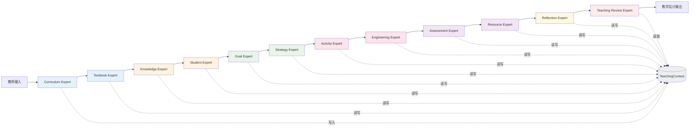
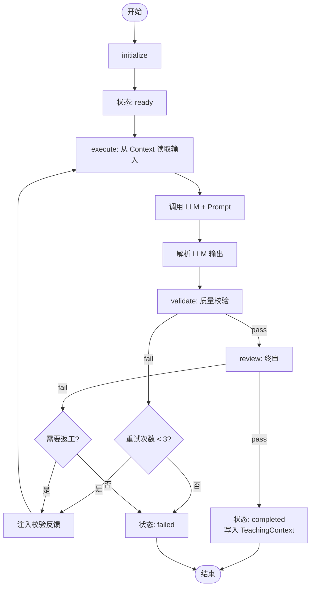
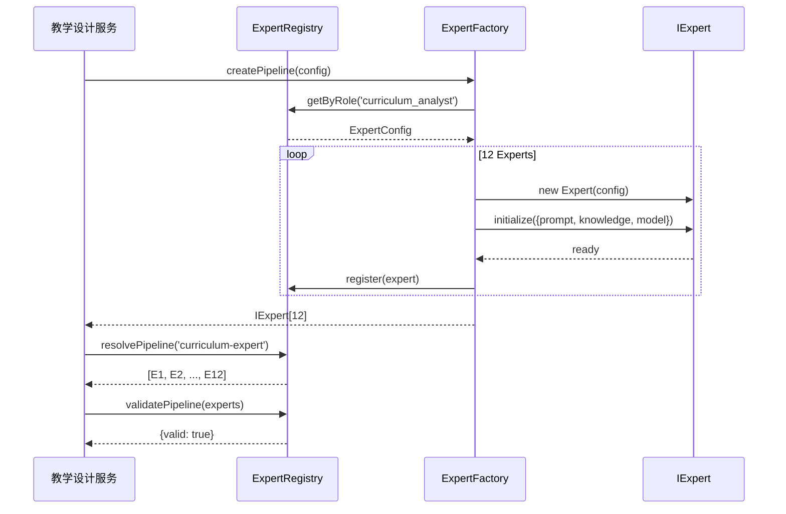
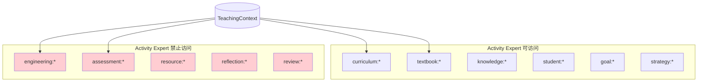
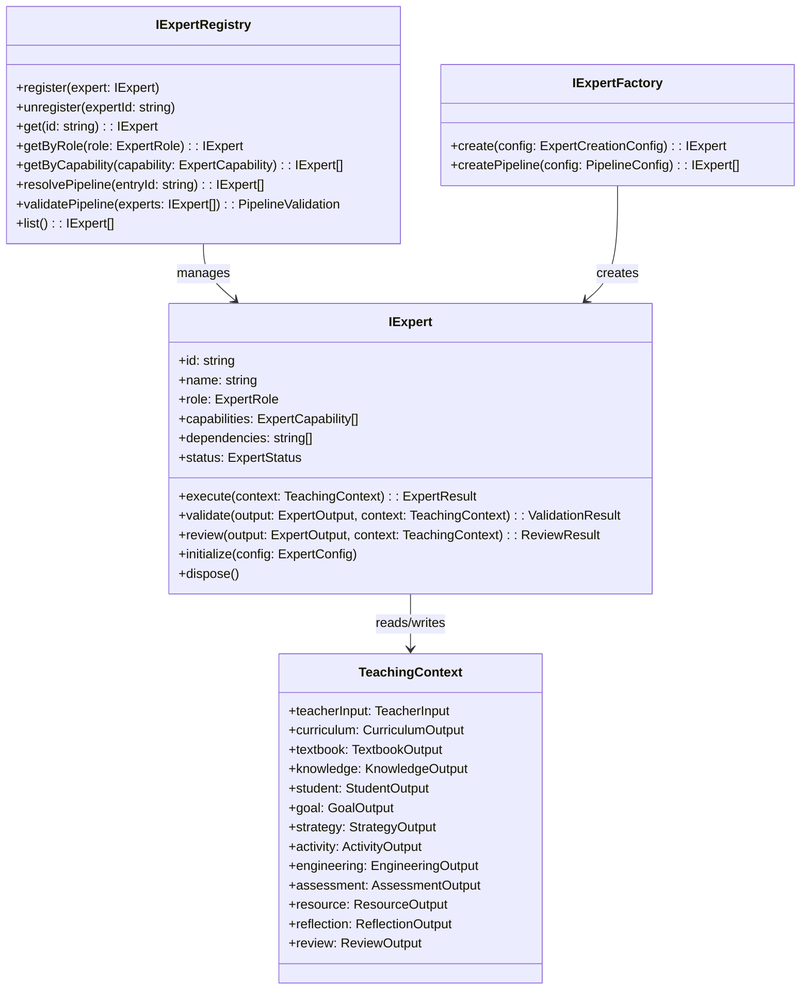

# Teaching Design Studio — Expert Workflow Architecture

> **Phase 3 — 设计阶段，不编码**
> **领域:** 中国普通高中《技术与工程》（原通用技术）
>
> ⚠️ **注意：本文档为 Phase 3 设计草案，已被 Phase 4 `EXPERT_SPECIFICATION.md` 取代。**
> 当前实际实现（见 `SKILL.md` 和 `manifest.json`）为 11 Expert 线性流水线 + Chief Expert 调度，
> 与本文档中 12 Expert P2P 通信模型不同。本文档仅供架构演进参考。

---

## 目录

1. [核心设计理念](#一核心设计理念)
2. [Expert 架构总览](#二expert-架构总览)
3. [IExpert 接口定义](#三iexpert-接口定义)
4. [Expert 生命周期](#四expert-生命周期)
5. [Expert 通信方式](#五expert-通信方式)
6. [Expert Registry](#六expert-registry)
7. [Expert Factory](#七expert-factory)
8. [12 位 Expert 职责矩阵](#八12-位-expert-职责矩阵)
9. [TeachingContext 扩展](#九teachingcontext-扩展)
10. [Mermaid 图集](#十mermaid-图集)
11. [设计决策记录](#十一设计决策记录)

---

## 一、核心设计理念

### 1.1 Expert ≠ Step

| | Step | Expert |
|---|------|--------|
| 粒度 | 技术操作单元 | 教育专业角色 |
| 职责 | 执行一个动作 | 完成一个专业判断 |
| Prompt | 通用模板 | 领域专业知识注入 |
| Validator | 结构校验 | 教育质量门禁 |
| 输出 | 原始数据 | 结构化教学设计片段 |

> **一个 Expert 内部可能包含多个 Step，但对 Workflow 层暴露为单一 Expert。**

### 1.2 铁律：单一职责

```
每个 Expert 只做一件事。

Curriculum Expert → 只解析课标，不设计活动
Activity Expert  → 只设计活动，不制定评价
Assessment Expert → 只设计评价，不分析学情

禁止越界。
```

### 1.3 工作流模式

```
教师输入
    │
    ▼
┌──────────────┐    ┌──────────────┐    ┌──────────────┐
│ Curriculum   │───▶│  Textbook    │───▶│  Knowledge   │
│   Expert     │    │   Expert     │    │   Expert     │
└──────────────┘    └──────────────┘    └──────────────┘
       │                   │                   │
       └───────────────────┼───────────────────┘
                           │  TeachingContext（共享）
                           ▼
┌──────────────┐    ┌──────────────┐    ┌──────────────┐
│  Student     │───▶│    Goal      │───▶│  Strategy    │
│   Expert     │    │   Expert     │    │   Expert     │
└──────────────┘    └──────────────┘    └──────────────┘
       │                   │                   │
       └───────────────────┼───────────────────┘
                           │
                           ▼
┌──────────────┐    ┌──────────────┐    ┌──────────────┐
│  Activity    │───▶│ Engineering  │───▶│ Assessment   │
│   Expert     │    │   Expert     │    │   Expert     │
└──────────────┘    └──────────────┘    └──────────────┘
       │                   │                   │
       └───────────────────┼───────────────────┘
                           │
                           ▼
┌──────────────┐    ┌──────────────┐    ┌──────────────┐
│  Resource    │───▶│ Reflection   │───▶│Teaching      │
│   Expert     │    │   Expert     │    │Review Expert │
└──────────────┘    └──────────────┘    └──────────────┘
                           │
                           ▼
                    完整教学设计输出
```

---

## 二、Expert 架构总览

```
┌─────────────────────────────────────────────────────────────────┐
│                     Teaching Design Studio                       │
│                                                                  │
│  ┌─────────────────────────────────────────────────────────┐    │
│  │                   Expert Orchestra                       │    │
│  │  (Workflow Engine 驱动 Expert 流水线)                     │    │
│  │                                                          │    │
│  │  Expert₁ ──▶ Expert₂ ──▶ Expert₃ ──▶ ... ──▶ Expert₁₂ │    │
│  │     │           │           │                  │         │    │
│  │     └───────────┴───────────┴──────────────────┘         │    │
│  │                        │                                  │    │
│  │                   TeachingContext                         │    │
│  └────────────────────────┬─────────────────────────────────┘    │
│                           │                                      │
│  ┌────────────────────────┼─────────────────────────────────┐    │
│  │              Expert Infrastructures                       │    │
│  │                                                          │    │
│  │  ┌──────────┐ ┌──────────┐ ┌──────────┐ ┌──────────┐   │    │
│  │  │ Registry │ │ Factory  │ │ Validator│ │ Reviewer │   │    │
│  │  └──────────┘ └──────────┘ └──────────┘ └──────────┘   │    │
│  │                                                          │    │
│  │  ┌──────────┐ ┌──────────┐ ┌──────────┐                 │    │
│  │  │ Prompt   │ │Knowledge │ │  LLM     │                 │    │
│  │  │ Engine   │ │ Engine   │ │ Provider │                 │    │
│  │  └──────────┘ └──────────┘ └──────────┘                 │    │
│  └─────────────────────────────────────────────────────────┘    │
└─────────────────────────────────────────────────────────────────┘
```

### 各层职责

| 层 | 组件 | 职责 |
|----|------|------|
| **Orchestra** | Expert Pipeline | 按顺序调度 Expert 执行 |
| **Context** | TeachingContext | 不可变共享上下文，Expert 间唯一通信载体 |
| **Infrastructure** | Registry / Factory | 管理 Expert 注册、发现、创建 |
| **Quality** | Validator / Reviewer | 输出质量校验 + 终审 |
| **Foundation** | Prompt / Knowledge / LLM | Phase 1-2 已构建的基础设施 |

---

## 三、IExpert 接口定义

```typescript
// ─── IExpert ─────────────────────────────────────────────

interface IExpert {
  // ── 身份 ──────────────────────────────────────────────
  readonly id: string;           // 唯一标识
  readonly name: string;         // 中文名称，如 "课标解读专家"
  readonly description: string;  // 职责描述
  readonly role: ExpertRole;     // 在教育流程中的角色

  // ── 能力 ──────────────────────────────────────────────
  readonly capabilities: ExpertCapability[];  // 能力标签
  readonly inputSchema: ExpertSchema;         // 输入结构定义
  readonly outputSchema: ExpertSchema;        // 输出结构定义
  readonly dependencies: string[];            // 依赖的前置 Expert ID

  // ── 执行 ──────────────────────────────────────────────
  execute(context: TeachingContext): Promise<ExpertResult>;
  validate(output: ExpertOutput, context: TeachingContext): Promise<ValidationResult>;
  review(output: ExpertOutput, context: TeachingContext): Promise<ReviewResult>;

  // ── 生命周期 ──────────────────────────────────────────
  initialize(config: ExpertConfig): Promise<void>;
  dispose(): void;

  // ── 观测 ──────────────────────────────────────────────
  readonly status: ExpertStatus;
  readonly metrics: ExpertMetrics;
}

// ─── 支持类型 ────────────────────────────────────────────

type ExpertRole =
  | 'curriculum_analyst'    // 课标分析
  | 'textbook_analyst'      // 教材分析
  | 'knowledge_organizer'   // 知识梳理
  | 'student_analyst'       // 学情分析
  | 'goal_designer'         // 目标设计
  | 'strategy_designer'     // 策略设计
  | 'activity_designer'     // 活动设计
  | 'engineering_designer'  // 工程实践设计
  | 'assessment_designer'   // 评价设计
  | 'resource_curator'      // 资源整合
  | 'reflection_designer'   // 反思设计
  | 'teaching_reviewer';    // 教学终审

type ExpertStatus =
  | 'uninitialized'
  | 'ready'
  | 'executing'
  | 'validating'
  | 'reviewing'
  | 'completed'
  | 'failed'
  | 'skipped';

type ExpertCapability =
  | 'curriculum_analysis'
  | 'textbook_analysis'
  | 'knowledge_organization'
  | 'student_analysis'
  | 'goal_design'
  | 'strategy_design'
  | 'activity_design'
  | 'engineering_design'
  | 'assessment_design'
  | 'resource_curation'
  | 'reflection_design'
  | 'teaching_review';

// ─── 输入输出 ────────────────────────────────────────────

interface ExpertConfig {
  promptTemplate: string;          // Prompt 模板引用
  knowledgeSources: string[];      // 知识源引用
  model?: string;                  // 使用的 LLM
  temperature?: number;
  maxTokens?: number;
  validationRules: ValidationRule[];
  reviewCriteria: ReviewCriterion[];
}

interface ExpertSchema {
  fields: SchemaField[];
  required: string[];
}

interface SchemaField {
  name: string;
  type: 'string' | 'number' | 'boolean' | 'array' | 'object';
  description: string;
}

interface ExpertOutput {
  readonly expertId: string;
  readonly expertName: string;
  readonly role: ExpertRole;
  readonly data: Record<string, unknown>;
  readonly metadata: ExpertOutputMetadata;
}

interface ExpertOutputMetadata {
  readonly timestamp: number;
  readonly contextVersion: number;
  readonly modelUsed: string;
  readonly tokensUsed: number;
  readonly durationMs: number;
}

// ─── 结果 ────────────────────────────────────────────────

interface ExpertResult {
  readonly expertId: string;
  readonly status: ExpertStatus;
  readonly output: ExpertOutput | null;
  readonly validation: ValidationResult | null;
  readonly review: ReviewResult | null;
  readonly error: string | null;
  readonly metrics: ExpertMetrics;
}

interface ExpertMetrics {
  readonly durationMs: number;
  readonly tokensInput: number;
  readonly tokensOutput: number;
  readonly tokensTotal: number;
  readonly llmCalls: number;
  readonly validationAttempts: number;
  readonly reviewScore: number;
}

interface ReviewResult {
  readonly passed: boolean;
  readonly score: number;        // 0-100
  readonly criteria: ReviewCriterionResult[];
  readonly suggestions: string[];
  readonly requiresRework: boolean;
}

interface ReviewCriterion {
  readonly name: string;
  readonly description: string;
  readonly weight: number;       // 0-1
  readonly minScore: number;     // 最低分
}

interface ReviewCriterionResult {
  readonly criterion: ReviewCriterion;
  readonly score: number;
  readonly passed: boolean;
  readonly comment: string;
}
```

---

## 四、Expert 生命周期

```
                    ┌──────────────┐
                    │uninitialized │
                    └──────┬───────┘
                           │ initialize(config)
                           ▼
                    ┌──────────────┐
              ┌─────│    ready     │◄────────────┐
              │     └──────┬───────┘             │
              │            │ execute(context)    │ retry
              │            ▼                     │
              │     ┌──────────────┐            │
              │     │  executing   │────────────┘
              │     └──────┬───────┘
              │            │ output produced
              │            ▼
              │     ┌──────────────┐
              │     │  validating  │
              │     └──┬───────┬───┘
              │        │       │
              │   pass │       │ fail → can retry?
              │        │       │          │
              │        ▼       │    ┌─────┘
              │  ┌──────────┐  │    ▼
              │  │reviewing │  │ ┌──────┐
              │  └────┬─────┘  │ │failed│
              │       │        │ └──┬───┘
              │  pass │ fail   │    │ skip?
              │       │        │    │
              │       ▼        │    ▼
              │  ┌──────────┐  │ ┌────────┐
              └──│completed │  │ │skipped │
                 └──────────┘  │ └────────┘
                               │
                      rework ──┘ → back to executing
```

### 生命周期规则

1. **每个 Expert 在 `execute()` 后必须经过 `validate()`**，不通过则进入 rework 循环
2. **Rework 最多 3 次**，超过则标记为 `failed` 或人工介入
3. **`review()` 是终审**，通过后将 output 写入 TeachingContext
4. **被跳过的 Expert** 标记为 `skipped`，Context 不写入其输出
5. **Expert 失败不阻塞整个 Workflow**，由 Teaching Review Expert 最终评估是否可发布

---

## 五、Expert 通信方式

### 5.1 唯一通信载体：TeachingContext

```
Expert_A ──(写入 context)──▶ TeachingContext ◀──(读取 context)── Expert_B

禁止 Expert 之间直接通信。
禁止 Expert 修改其他 Expert 的输出。
```

### 5.2 Context 写入规范

每个 Expert 写入 Context 的 key 格式：

```
expert:{expertId}:output    → ExpertOutput.data
expert:{expertId}:metadata  → ExpertOutputMetadata
expert:{expertId}:status    → ExpertStatus
```

### 5.3 Context 读取顺序

Expert 只能读取 **已经完成且写入 Context** 的前置 Expert 输出：

```
Activity Expert 可以读取：
  ✓ curriculum   (前置)
  ✓ textbook     (前置)
  ✓ knowledge    (前置)
  ✓ student      (前置)
  ✓ goal         (前置)
  ✓ strategy     (前置)
  ✗ engineering  (后置，不可读)
  ✗ assessment   (后置，不可读)
```

### 5.4 Expert 输入聚合

每个 Expert 的 `execute(context)` 接收完整 TeachingContext，内部自动过滤：

```typescript
// Expert 内部逻辑
function resolveInput(context: TeachingContext): ExpertInput {
  const relevantKeys = this.dependencies.map(depId =>
    `expert:${depId}:output`
  );
  const teacherInput = context.get('teacher:input');
  return { teacherInput, priorOutputs: context.pick(relevantKeys) };
}
```

---

## 六、Expert Registry

### 6.1 职责

- **注册**：所有 Expert 启动时注册到 Registry
- **发现**：按 capability / role / dependency 查询 Expert
- **校验**：检查 Expert 链是否完整（无缺失依赖）

### 6.2 接口

```typescript
interface IExpertRegistry {
  // 注册
  register(expert: IExpert): void;
  unregister(expertId: string): void;

  // 发现
  get(id: string): IExpert | null;
  getByRole(role: ExpertRole): IExpert | null;
  getByCapability(capability: ExpertCapability): IExpert[];

  // 编排
  resolvePipeline(entryExpertId: string): IExpert[];  // 解析完整 Expert 链
  validatePipeline(experts: IExpert[]): PipelineValidation;

  // 查询
  list(): IExpert[];
  has(id: string): boolean;
}

interface PipelineValidation {
  readonly valid: boolean;
  readonly missingDependencies: string[];
  readonly circularDependencies: string[][];
  readonly unregisteredExperts: string[];
}
```

### 6.3 Expert 注册清单

```
Registry
├── curriculum-expert       (role: curriculum_analyst)
├── textbook-expert         (role: textbook_analyst)
├── knowledge-expert        (role: knowledge_organizer)
├── student-expert          (role: student_analyst)
├── goal-expert             (role: goal_designer)
├── strategy-expert         (role: strategy_designer)
├── activity-expert         (role: activity_designer)
├── engineering-expert      (role: engineering_designer)
├── assessment-expert       (role: assessment_designer)
├── resource-expert         (role: resource_curator)
├── reflection-expert       (role: reflection_designer)
└── teaching-review-expert  (role: teaching_reviewer)
```

---

## 七、Expert Factory

### 7.1 职责

- 根据 Expert 类型创建实例
- 注入依赖（Prompt Engine、Knowledge Engine、LLM Provider）
- 配置 Validator 和 Reviewer

### 7.2 接口

```typescript
interface IExpertFactory {
  create(config: ExpertCreationConfig): IExpert;
  createPipeline(pipelineConfig: PipelineConfig): IExpert[];
}

interface ExpertCreationConfig {
  readonly type: ExpertRole;
  readonly promptTemplateId: string;
  readonly knowledgeSourceIds: string[];
  readonly model?: string;
  readonly validationRules: ValidationRule[];
  readonly reviewCriteria: ReviewCriterion[];
  readonly customConfig?: Record<string, unknown>;
}

interface PipelineConfig {
  readonly expertTypes: ExpertRole[];
  readonly sharedKnowledgeSources: string[];
  readonly defaultModel: string;
}
```

### 7.3 创建流程

```
Factory.create(config)
  │
  ├─ 1. 解析 Expert 类型 → 确定 Expert 类
  ├─ 2. 加载 Prompt 模板 → Prompt Engine
  ├─ 3. 加载 Knowledge 源 → Knowledge Engine
  ├─ 4. 构建 Validator → 注入 validationRules
  ├─ 5. 构建 Reviewer → 注入 reviewCriteria
  ├─ 6. 注入 LLM Provider
  ├─ 7. 调用 expert.initialize(config)
  └─ 返回 IExpert 实例
```

---

## 八、12 位 Expert 职责矩阵

| # | Expert | 角色 | 输入（来自Context） | 输出 | 禁止做的事 |
|---|--------|------|---------------------|------|-----------|
| 1 | **Curriculum Expert** | 课标分析 | 教师输入（教材/章节） | 课标要求、核心素养、学业质量水平 | 不分析教材、不设计活动 |
| 2 | **Textbook Expert** | 教材分析 | 课标输出 + 教师输入 | 教材地位、内容结构、前后联系 | 不梳理知识点、不分析学情 |
| 3 | **Knowledge Expert** | 知识梳理 | 教材输出 + 课标输出 | 知识点清单、概念层级、重难点 | 不设计目标、不设计评价 |
| 4 | **Student Expert** | 学情分析 | 教师输入（学情）+ 知识输出 | 已有基础、学习障碍、分层策略 | 不设计活动、不制定目标 |
| 5 | **Goal Expert** | 目标设计 | 课标+教材+知识+学情 | 教学目标（知识/能力/素养三维） | 不选策略、不设计评价 |
| 6 | **Strategy Expert** | 策略设计 | 目标+学情+知识 | 教学方法、教学模式、教学策略 | 不设计具体活动、不选资源 |
| 7 | **Activity Expert** | 活动设计 | 策略+目标+学情 | 教学环节、活动设计、时间分配 | 不设计工程实践、不定评价标准 |
| 8 | **Engineering Expert** | 工程实践 | 活动+知识+策略 | 工程实践任务、项目流程、工具材料 | 不设计评价、不选资源 |
| 9 | **Assessment Expert** | 评价设计 | 目标+活动+工程实践 | 评价方案、评价标准、评价工具 | 不设计活动、不定目标 |
| 10 | **Resource Expert** | 资源整合 | 活动+工程实践+评价 | 教学资源清单、课件素材、参考链接 | 不设计教学、不定策略 |
| 11 | **Reflection Expert** | 反思设计 | 全部前置 Expert 输出 | 教学反思框架、预设问题、改进方向 | 不终审、不修改他人输出 |
| 12 | **Teaching Review Expert** | 教学终审 | 全部 Expert 输出 | 终审报告、质量评分、修改建议 | 不重新生成内容、只评审 |

### 8.1 每位 Expert 的具体输入/输出

#### 1. Curriculum Expert（课标解读专家）

```
输入：
  teacher.input.subject       → 学科："技术与工程"
  teacher.input.grade         → 年级："高一"
  teacher.input.textbook      → 教材版本："苏教版"
  teacher.input.chapter       → 章节信息

输出：
  curriculum.standard_requirements    → 对应课标条目
  curriculum.core_competencies        → 核心素养要求
  curriculum.academic_quality_levels  → 学业质量水平
  curriculum.teaching_suggestions     → 课标教学建议
```

#### 2. Textbook Expert（教材分析专家）

```
输入：
  teacher.input.textbook_version  → 教材版本
  teacher.input.chapter           → 章节
  curriculum.standard_requirements → 课标要求

输出：
  textbook.chapter_position       → 本章在教材中的地位
  textbook.content_structure      → 内容结构（节/目/知识点编排）
  textbook.front_back_linkage     → 前后章节联系
  textbook.editorial_intent       → 编者意图分析
```

#### 3. Knowledge Expert（知识梳理专家）

```
输入：
  textbook.content_structure      → 教材内容结构
  curriculum.standard_requirements → 课标要求
  teacher.input.topic             → 课题

输出：
  knowledge.concept_map           → 概念图/知识图谱
  knowledge.key_points            → 教学重点
  knowledge.difficult_points      → 教学难点
  knowledge.knowledge_hierarchy   → 知识层级（事实/概念/方法/价值）
```

#### 4. Student Expert（学情分析专家）

```
输入：
  teacher.input.student_profile   → 学情描述
  knowledge.key_points            → 教学重点
  knowledge.difficult_points      → 教学难点

输出：
  student.existing_knowledge      → 已有知识基础
  student.learning_barriers       → 学习障碍预判
  student.tiered_strategy         → 分层策略（A/B/C层）
  student.motivation_factors      → 学习动机因素
```

#### 5. Goal Expert（目标设计专家）

```
输入：
  curriculum.core_competencies    → 核心素养
  knowledge.key_points            → 教学重点
  student.existing_knowledge      → 学情
  teacher.input.lesson_period     → 课时信息

输出：
  goal.knowledge_objectives       → 知识与技能目标
  goal.ability_objectives         → 过程与方法目标
  goal.literacy_objectives        → 情感态度价值观/核心素养目标
  goal.measurable_indicators      → 可观测的行为指标
```

#### 6. Strategy Expert（策略设计专家）

```
输入：
  goal.*                          → 教学目标
  student.learning_barriers       → 学习障碍
  knowledge.concept_map           → 知识结构
  teacher.input.teaching_mode     → 教学模式偏好

输出：
  strategy.teaching_methods       → 教学方法选择
  strategy.teaching_mode          → 教学模式
  strategy.learning_organization  → 学习组织形式
  strategy.media_application      → 媒体应用策略
```

#### 7. Activity Expert（活动设计专家）

```
输入：
  strategy.*                      → 教学策略
  goal.*                          → 教学目标
  student.*                       → 学情
  knowledge.*                     → 知识结构

输出：
  activity.teaching_process       → 教学过程（导入/新授/巩固/小结）
  activity.teacher_activities     → 教师活动
  activity.student_activities     → 学生活动
  activity.time_allocation        → 时间分配
  activity.design_intent          → 设计意图
```

#### 8. Engineering Expert（工程实践专家）

```
输入：
  activity.teaching_process       → 教学过程
  knowledge.concept_map           → 知识结构
  strategy.teaching_methods       → 教学方法
  teacher.input.equipment         → 可用设备/工具

输出：
  engineering.project_task        → 工程实践任务
  engineering.project_flow        → 项目流程
  engineering.tools_materials     → 工具与材料清单
  engineering.safety_guidelines   → 安全规范
  engineering.evaluation_rubric   → 作品评价量规（供Assessment Expert使用）
```

#### 9. Assessment Expert（评价设计专家）

```
输入：
  goal.*                          → 教学目标
  activity.teaching_process       → 教学过程
  engineering.project_task        → 工程实践任务

输出：
  assessment.evaluation_plan      → 评价方案
  assessment.evaluation_criteria  → 评价标准
  assessment.evaluation_tools     → 评价工具（量表/观察表/试题）
  assessment.feedback_mechanism   → 反馈机制
```

#### 10. Resource Expert（资源整合专家）

```
输入：
  activity.teaching_process       → 教学过程
  engineering.tools_materials     → 工具材料
  assessment.evaluation_tools     → 评价工具

输出：
  resource.teaching_resources     → 教学资源清单
  resource.multimedia_materials   → 多媒体素材
  resource.reference_links        → 参考链接/拓展阅读
  resource.preview_requirements   → 课前准备要求
```

#### 11. Reflection Expert（反思设计专家）

```
输入：
  全部前置 Expert 输出

输出：
  reflection.teaching_reflection_framework  → 反思框架
  reflection.preset_questions               → 预设反思问题
  reflection.improvement_directions         → 改进方向
  reflection.expected_challenges            → 预期挑战与应对
```

#### 12. Teaching Review Expert（教学终审专家）

```
输入：
  全部 Expert 输出 + 教学设计完整稿

输出：
  review.overall_score              → 总体评分（0-100）
  review.dimension_scores           → 各维度评分
  review.strengths                  → 亮点
  review.weaknesses                 → 不足
  review.revision_suggestions       → 修改建议
  review.ready_to_publish           → 是否可发布
```

---

## 九、TeachingContext 扩展

在 Phase 2 的 `TeachingContext` 基础上增加教学领域字段：

```typescript
interface TeachingContext {
  // ── Phase 2 基础字段 ──────────────────────────────────
  readonly meta: ContextMeta;
  readonly version: number;
  readonly hash: string;

  // ── Phase 3 教学专用字段 ──────────────────────────────
  readonly teacher: TeacherInput;          // 教师原始输入
  readonly curriculum: CurriculumOutput;   // Expert 1 输出
  readonly textbook: TextbookOutput;       // Expert 2 输出
  readonly knowledge: KnowledgeOutput;     // Expert 3 输出
  readonly student: StudentOutput;         // Expert 4 输出
  readonly goal: GoalOutput;               // Expert 5 输出
  readonly strategy: StrategyOutput;       // Expert 6 输出
  readonly activity: ActivityOutput;       // Expert 7 输出
  readonly engineering: EngineeringOutput; // Expert 8 输出
  readonly assessment: AssessmentOutput;   // Expert 9 输出
  readonly resource: ResourceOutput;       // Expert 10 输出
  readonly reflection: ReflectionOutput;   // Expert 11 输出
  readonly review: ReviewOutput;           // Expert 12 输出

  // ── 教师原始输入 ─────────────────────────────────────
  readonly teacherInput: {
    subject: string;           // 学科
    grade: string;             // 年级
    textbookVersion: string;   // 教材版本
    chapter: string;           // 章节
    topic: string;             // 课题
    lessonPeriod: number;      // 第几课时
    totalPeriods: number;      // 共几课时
    studentProfile: string;    // 学情描述
    teachingMode: string;      // 教学模式偏好
    equipment: string;         // 可用设备
    additionalRequirements?: string;
  };
}
```

---

## 十、Mermaid 图集

### 10.1 Expert 流水线主流程



### 10.2 Expert 内部执行流程



### 10.3 Expert 注册与编排



### 10.4 数据隔离——Expert 禁止越界



### 10.5 Expert 注册表结构



---

## 十一、设计决策记录

| # | 决策 | 理由 |
|---|------|------|
| 1 | **Expert 而非 Step** | 教育领域需要专业角色概念，比技术 Step 更符合教师认知 |
| 2 | **Context 是唯一通信载体** | 保持 Phase 2 的 Immutable 原则，避免 Expert 间耦合 |
| 3 | **Expert 间只通过前置依赖读数据** | 防止越界、防止后置 Expert 影响前置逻辑 |
| 4 | **validate + review 两层质控** | validate 是规则性校验（格式、完整性），review 是教育质量评审 |
| 5 | **Factory 创建 Expert 实例** | 解耦 Expert 实现和依赖注入 |
| 6 | **Registry 管理 Expert 生命周期** | 支持动态加载、Skill 包发现 |
| 7 | **每个 Expert 独立的 Prompt 模板** | 每个 Expert 有不同的专业视角，Prompt 不应共享 |
| 8 | **Teaching Review Expert 只评审不修改** | 保持各 Expert 输出的可追溯性 |
| 9 | **Expert 失败不阻塞整个流程** | 教学终审 Expert 最终判断整体质量 |
| 10 | **禁止 Expert 做自己职责之外的事** | Prompt 中明确约束，Validator 中校验 |

---

> **状态:** 设计完成，等待确认后进入 Phase 3 编码阶段
