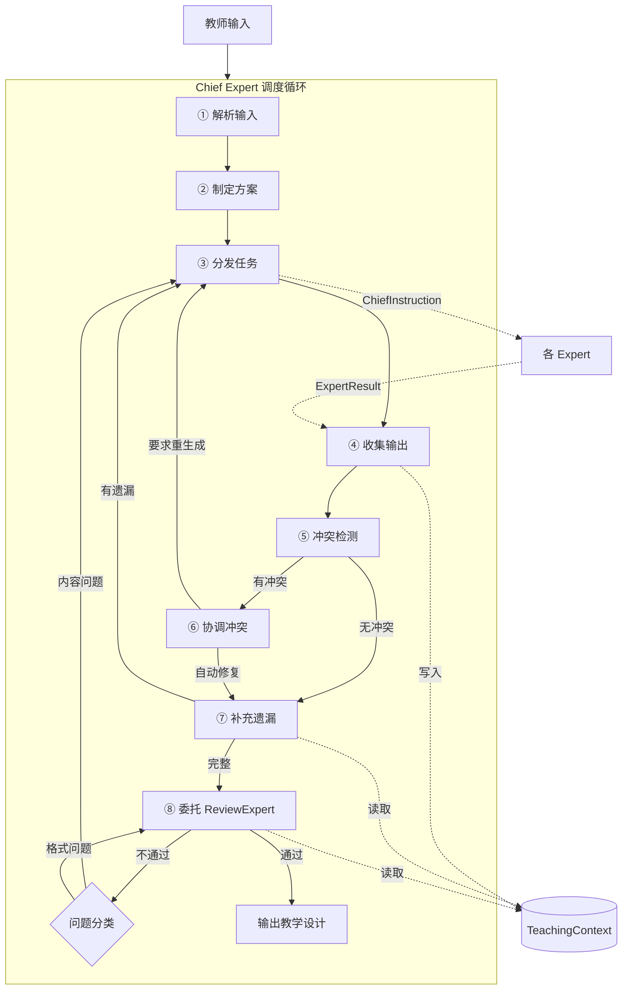
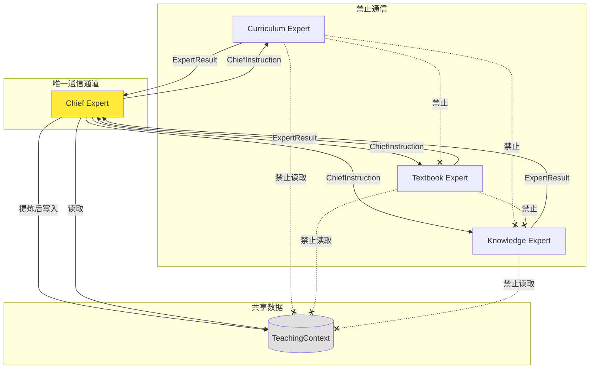
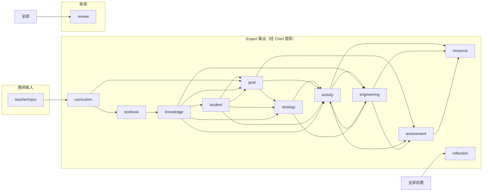
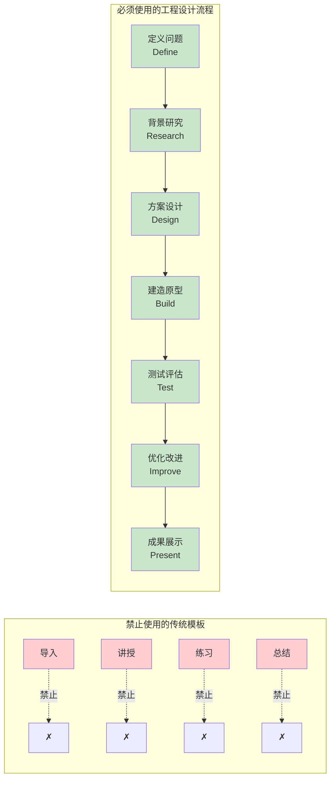

# OpenLearn Teaching Design Studio — Expert Specification

> **Phase 4 — Expert 详细规格设计，不编码**
> **领域:** 中国普通高中《技术与工程》（原通用技术）
>
> ⚠️ **注意：本文档为 Phase 4 设计规格，实际实现（见 `SKILL.md` 和 `manifest.json`）为简化版：**
> 11 Expert 线性流水线，尚未实现文档中的冲突检测、自动协调、循环重试等机制。
> 本文档作为未来改进方向的参考。

---

## 目录

1. [架构总览](#一架构总览)
2. [IExpert 增强接口](#二iexpert-增强接口)
3. [Expert 统一规范](#三expert-统一规范)
4. [Chief Expert 调度机制](#四chief-expert-调度机制)
5. [Expert 通信机制](#五expert-通信机制)
6. [Expert 生命周期](#六expert-生命周期)
7. [TeachingContext 数据结构](#七teachingcontext-数据结构)
8. [Expert Registry 与目录结构](#八expert-registry-与目录结构)
9. [13 位 Expert 详细职责](#九13-位-expert-详细职责)
10. [Mermaid 图集](#十mermaid-图集)

---

## 一、架构总览

### 1.1 架构图

```
教师输入
    │
    ▼
┌──────────────────────────────────────────────────────────────┐
│                     Chief Expert（首席教学设计专家）            │
│                                                              │
│  ① 解析教师输入     ② 制定整体方案     ③ 分配任务              │
│  ④ 收集 Expert 输出  ⑤ 冲突检测        ⑥ 协调冲突              │
│  ⑦ 补充遗漏         ⑧ 输出最终教学设计                          │
└──────┬───────┬───────┬───────┬───────┬───────┬──────────────┘
       │       │       │       │       │       │
       ▼       ▼       ▼       ▼       ▼       ▼
   ┌──────────────────────────────────────────────────────────┐
   │              TeachingContext（唯一共享上下文）               │
   └──────────────────────────────────────────────────────────┘
       │       │       │       │       │       │
       ▼       ▼       ▼       ▼       ▼       ▼
┌──────┐┌──────┐┌──────┐┌──────┐┌──────┐┌──────┐  ...
│  C   ││  T   ││  K   ││  S   ││  G   ││  St   │
│  u   ││  e   ││  n   ││  t   ││  o   ││  r   │
│  r   ││  x   ││  o   ││  u   ││  a   ││  a   │
│  r   ││  t   ││  w   ││  d   ││  l   ││  t   │
│  i   ││  b   ││  l   ││  e   ││      ││  e   │
│  c   ││  o   ││  e   ││  n   ││  E   ││  g   │
│  u   ││  o   ││  d   ││  t   ││  x   ││  y   │
│  l   ││  k   ││  g   ││      ││  p   ││      │
│  u   ││      ││  e   ││  E   ││  e   ││  E   │
│  m   ││  E   ││      ││  x   ││  r   ││  x   │
│      ││  x   ││  E   ││  p   ││  t   ││  p   │
│  E   ││  p   ││  x   ││  e   ││      ││  e   │
│  x   ││  e   ││  p   ││  r   ││      ││  r   │
│  p   ││  r   ││  e   ││  t   ││      ││  t   │
│  e   ││  t   ││  r   ││      ││      ││      │
│  r   ││      ││  t   ││      ││      ││      │
│  t   ││      ││      ││      ││      ││      │
└──────┘└──────┘└──────┘└──────┘└──────┘└──────┘  ...
                                                 ┌──────────┐
                                                 │ Teaching │
                                                 │  Review  │
                                                 │  Expert  │
                                                 └──────────┘
```

### 1.2 核心设计变更（对比 Phase 3）

| 维度 | Phase 3 | Phase 4 |
|------|---------|---------|
| 协调方式 | 线性流水线，Expert 之间通过 Context 读写 | Chief Expert 集中调度，Expert 不直接读 Context |
| Expert 数量 | 12 | 13（+ Chief Expert） |
| Expert 规范 | 8 字段 | 14 字段（增加 ThinkingFramework, Constraints, Deliverables 等） |
| 通信模型 | Expert ↔ TeachingContext | Expert ↔ Chief Expert ↔ TeachingContext |
| Activity Expert | 传统教学流程（导入→新授→巩固→小结） | 工程设计流程（禁止传统模板） |
| Review Checklist | 2 项 criteria | 9 项专项审核 |

---

## 二、IExpert 增强接口

```typescript
// ─── IExpert（Phase 4 增强版）─────────────────────────────

interface IExpert {
  // ── 身份（7 项）────────────────────────────────────────
  readonly id: string;
  readonly name: string;               // 中文名称
  readonly description: string;        // 一句话描述
  readonly role: ExpertRole;           // 角色枚举
  readonly goal: string;               // 专家目标
  readonly knowledgeScope: string[];   // 知识边界（可用的知识域）
  readonly responsibilities: string[]; // 具体职责清单

  // ── 输入输出（4 项）─────────────────────────────────────
  readonly input: ExpertInputSpec;     // 输入规范
  readonly output: ExpertOutputSpec;   // 输出规范
  readonly constraints: ExpertConstraint[];  // 约束/禁止事项
  readonly deliverables: string[];     // 可交付物清单

  // ── 工作流（3 项）─────────────────────────────────────
  readonly workflow: ExpertWorkflow;   // 内部工作步骤
  readonly thinkingFramework: string;  // 思维框架（如 Bloom 分类学、工程设计思维）
  readonly qualityChecklist: QualityCheckItem[]; // 自检清单

  // ── Prompt + 校验（3 项）───────────────────────────────
  promptTemplate: string;              // Prompt 模板
  readonly validationRules: ValidationRule[];
  readonly reviewCriteria: ReviewCriterion[];

  // ── 生命周期方法（7 项）────────────────────────────────
  initialize(config: ExpertConfig): Promise<void>;
  execute(context: TeachingContext, instruction?: ChiefInstruction): Promise<ExpertResult>;
  validate(output: ExpertOutput): Promise<ValidationResult>;
  review(output: ExpertOutput): Promise<ReviewResult>;
  serialize(): ExpertSnapshot;
  deserialize(snapshot: ExpertSnapshot): void;
  dispose(): void;

  // ── 状态（2 项）────────────────────────────────────────
  readonly status: ExpertStatus;
  readonly metrics: ExpertMetrics;
}
```

### 2.1 新增类型

```typescript
// ─── Chief Instruction ──────────────────────────────────

interface ChiefInstruction {
  readonly taskId: string;            // 任务 ID
  readonly taskDescription: string;   // 任务描述
  readonly priority: number;          // 优先级 1-10
  readonly dependencies: string[];    // 前置 Expert 完成 ID 列表
  readonly contextSnapshot: Record<string, unknown>; // Chief 提炼的相关 Context
  readonly constraints: string[];     // Chief 附加约束
  readonly expectedDeliverables: string[]; // 期望交付物
}

// ─── Expert 输入/输出规范 ────────────────────────────────

interface ExpertInputSpec {
  readonly requiredFields: SchemaField[];
  readonly optionalFields: SchemaField[];
  readonly contextKeys: string[];       // 从 TeachingContext 读取的 key
}

interface ExpertOutputSpec {
  readonly fields: SchemaField[];
  readonly format: 'json' | 'markdown' | 'mixed';
  readonly required: string[];
}

// ─── Expert 约束 ────────────────────────────────────────

interface ExpertConstraint {
  readonly type: 'must' | 'must_not' | 'should' | 'should_not';
  readonly description: string;
  readonly severity: 'critical' | 'warning';
}

// ─── Expert 工作流 ──────────────────────────────────────

interface ExpertWorkflow {
  readonly steps: WorkflowStepDescription[];
  readonly maxIterations: number;
  readonly timeoutMs: number;
}

interface WorkflowStepDescription {
  readonly order: number;
  readonly name: string;
  readonly description: string;
  readonly outputArtifact: string;     // 产出物名称
}

// ─── 质检项 ─────────────────────────────────────────────

interface QualityCheckItem {
  readonly id: string;
  readonly category: 'completeness' | 'accuracy' | 'alignment' | 'format' | 'logic';
  readonly description: string;
  readonly check: string;              // 检查方法描述
}

// ─── Expert 快照 ────────────────────────────────────────

interface ExpertSnapshot {
  readonly expertId: string;
  readonly role: ExpertRole;
  readonly status: ExpertStatus;
  readonly lastOutput: ExpertOutput | null;
  readonly metrics: ExpertMetrics;
  readonly timestamp: number;
}
```

---

## 三、Expert 统一规范

### 3.1 14 项统一规范

每位 Expert 必须填写以下 14 项规范：

| # | 字段 | 类型 | 说明 |
|---|------|------|------|
| 1 | `name` | `string` | 中文名称，如"课标解读专家" |
| 2 | `role` | `ExpertRole` | 角色枚举 |
| 3 | `goal` | `string` | 一句话描述核心目标 |
| 4 | `responsibilities` | `string[]` | 具体职责清单（3-8 条） |
| 5 | `knowledgeScope` | `string[]` | 知识边界（本 Expert 可使用哪些知识域） |
| 6 | `input` | `ExpertInputSpec` | 输入字段 + Context 读取 key |
| 7 | `output` | `ExpertOutputSpec` | 输出字段 + 格式 + 必填项 |
| 8 | `workflow` | `ExpertWorkflow` | 内部工作步骤（3-5 步） |
| 9 | `thinkingFramework` | `string` | 采用的教育/思维框架 |
| 10 | `promptTemplate` | `string` | Prompt 模板（Markdown 格式） |
| 11 | `validationRules` | `ValidationRule[]` | 输出校验规则 |
| 12 | `qualityChecklist` | `QualityCheckItem[]` | 自检清单 |
| 13 | `constraints` | `ExpertConstraint[]` | 约束（必须做的 / 禁止做的） |
| 14 | `deliverables` | `string[]` | 可交付物清单 |

### 3.2 Expert 间边界划分铁律

```
┌─────────────────────────────────────────────────────────────┐
│                                                             │
│  每个 Expert 只能在其 knowledgeScope 范围内工作。              │
│                                                             │
│  Expert 的 output 必须与其 role 匹配。                        │
│                                                             │
│  Expert 只能接收 Chief Expert 的 instruction 作为输入。        │
│                                                             │
│  Expert 不得主动读取其他 Expert 的输出（由 Chief 提炼后下发）。   │
│                                                             │
│  Expert 不得生成 constraints.must_not 中列出的内容。           │
│                                                             │
└─────────────────────────────────────────────────────────────┘
```

---

## 四、Chief Expert 调度机制

### 4.1 Chief Expert 职责全景

```
Chief Expert 是唯一能写入 TeachingContext 的 Expert。

                    教师输入
                        │
                        ▼
              ┌─────────────────────┐
              │ ① 解析教师输入       │  提取：教材/年级/章节/学情/模式
              └─────────┬───────────┘
                        ▼
              ┌─────────────────────┐
              │ ② 制定整体方案       │  确定 Expert 执行顺序 + 依赖关系
              └─────────┬───────────┘
                        ▼
              ┌─────────────────────┐
              │ ③ 分配任务           │  → Curriculum Expert
              │                      │  → Textbook Expert
              │  生成 ChiefInstruction│  → Knowledge Expert
              │  逐个下发给 Expert    │  → ... 
              └─────────┬───────────┘
                        ▼
              ┌─────────────────────┐
              │ ④ 收集输出           │  接收 ExpertResult
              │                      │  提取关键信息写入 TeachingContext
              │  判断是否需要重新生成  │
              └─────────┬───────────┘
                        ▼
              ┌─────────────────────┐
              │ ⑤ 冲突检测           │  检测跨 Expert 输出矛盾
              └─────────┬───────────┘
                        ▼
              ┌─────────────────────┐
              │ ⑥ 协调冲突           │  自动修复 / 要求 Expert 重新生成
              └─────────┬───────────┘
                        ▼
              ┌─────────────────────┐
              │ ⑦ 补充遗漏           │  检测缺失内容 → 要求补充
              └─────────┬───────────┘
                        ▼
              ┌─────────────────────┐
              │ ⑧ 终审 & 输出        │  委托 TeachingReviewExpert
              │                      │  汇总输出完整教学设计
              └─────────────────────┘
```

### 4.2 Chief Expert 调度算法

```typescript
interface ChiefScheduler {
  // 调度入口
  orchestrate(input: TeacherInput): Promise<TeachingDesign>;

  // 内部步骤
  parseInput(input: TeacherInput): ParsedInput;
  createMasterPlan(parsed: ParsedInput): MasterPlan;
  dispatchToExpert(plan: MasterPlan, phase: ExpertPhase): Promise<ExpertResult[]>;
  detectConflicts(results: ExpertResult[]): Conflict[];
  resolveConflicts(conflicts: Conflict[]): Resolution[];
  fillGaps(design: PartialTeachingDesign): MissingItem[];
  finalReview(design: TeachingDesign): Promise<FinalReview>;
  compileOutput(design: TeachingDesign): TeachingDesignDocument;
}
```

### 4.3 冲突检测与协调

```
冲突类型：

1. 目标冲突
   Goal Expert 的目标与 Assessment Expert 的评价不匹配
   → 对比 measurableIndicators ↔ evaluationCriteria

2. 活动冲突
   Activity Expert 的活动设计没有体现 Engineering Expert 的项目任务
   → 对比 teachingProcess ↔ projectTask

3. 时间冲突
   活动时长之和超过总课时
   → 累加 timeAllocation ↔ totalDurationMinutes

4. 学情冲突
   Strategy Expert 的策略不符合 Student Expert 的学情分析
   → 对比 teachingMethods ↔ learningBarriers

5. 资源冲突
   Resource Expert 提供的资源不匹配 Engineering Expert 的需求
   → 对比 teachingResources ↔ toolsMaterials

协调策略：
  → 自动修正（兼容性映射）
  → 要求源 Expert 重新生成（冲突超过阈值）
  → 标记为待人工确认（无法自动决策）
```

### 4.4 Chief Expert 与其他 Expert 的关系

```
Chief Expert == 唯一的调度者 + 唯一的 Context 写入者

Chief Expert ──(ChiefInstruction)──► Curriculum Expert
Curriculum Expert ──(ExpertResult)──► Chief Expert
Chief Expert ──(写入 Context)──────► TeachingContext

Chief Expert ──(ChiefInstruction)──► Textbook Expert
Textbook Expert ──(ExpertResult)──► Chief Expert
Chief Expert ──(写入 Context)──────► TeachingContext

... 以此类推

TeachingContext 是 Chief Expert 的输出载体，不是 Expert 间的通信介质。
```

---

## 五、Expert 通信机制

### 5.1 通信协议

```
┌─────────────────────────────────────────────────────────────┐
│                                                             │
│  禁止 Expert ↔ Expert 直接通信                               │
│                                                             │
│  禁止 Expert 直接读取 TeachingContext                          │
│                                                             │
│  所有通信必须经过 Chief Expert：                               │
│                                                             │
│  Chief → Expert:  ChiefInstruction（任务 + 上下文片段）         │
│  Expert → Chief:  ExpertResult（输出 + 校验 + 指标）           │
│  Chief → Context: Chief 提炼后写入 TeachingContext              │
│                                                             │
└─────────────────────────────────────────────────────────────┘
```

### 5.2 通信序列

```typescript
// 1. Chief Expert 给 Expert 下发任务
interface ChiefInstruction {
  taskId: string;                    // "task-curriculum-001"
  taskDescription: string;           // "请分析苏教版技术与工程必修一第三章的课标要求"
  priority: number;                  // 1
  dependencies: string[];            // []（Curriculum 无前置）
  contextSnapshot: {                 // Chief 从 TeacherInput 提炼的相关信息
    subject: "技术与工程",
    grade: "高一",
    textbookVersion: "苏教版",
    chapter: "第三章 系统与设计",
    topic: "系统的结构"
  };
  constraints: string[];             // ["仅分析课标，不涉及教材内容"]
  expectedDeliverables: string[];    // ["课标条目", "核心素养映射", "教学建议"]
}

// 2. Expert 返回结果给 Chief
interface ExpertResult {
  expertId: string;
  taskId: string;                    // 关联的 taskId
  status: ExpertStatus;
  output: ExpertOutput | null;       // 结构化输出
  validation: ValidationResult | null;
  review: ReviewResult | null;
  error: string | null;
  metrics: ExpertMetrics;
}

// 3. Chief 提炼后写入 TeachingContext
// Chief 不直接透传 Expert 原始输出，而是经过提炼、归类后写入
```

---

## 六、Expert 生命周期

### 6.1 状态机

```
                    ┌──────────────┐
                    │ UNINITIALIZED│
                    └──────┬───────┘
                           │ Chief: initialize(config)
                           ▼
                    ┌──────────────┐
                    │    READY     │◄───────────────────┐
                    └──────┬───────┘                    │
                           │ Chief: execute(ctx, instr) │
                           ▼                            │
                    ┌──────────────┐                    │
                    │  EXECUTING   │                    │
                    └──────┬───────┘                    │
                           │ buildPrompt → callLLM → parseOutput
                           ▼                            │
                    ┌──────────────┐                    │
                    │  VALIDATING  │                    │
                    └──┬───────┬───┘                    │
                       │       │                        │
                  pass │       │ fail                   │
                       │       ▼                        │
                       │  ┌──────────┐                  │
                       │  │ retry≤3? │─── yes ──────────┘
                       │  └────┬─────┘
                       │       │ no
                       │       ▼
                       │  ┌──────────┐
                       │  │  FAILED  │──► Chief 决定是否跳过
                       │  └──────────┘
                       ▼
                ┌──────────────┐
                │  REVIEWING   │
                └──┬───────┬───┘
                   │       │
              pass │       │ fail → Chief 评估是否需要 rework
                   │       │
                   ▼       ▼
            ┌──────────┐ ┌──────────┐
            │ COMPLETED│ │  FAILED  │
            └──────────┘ └──────────┘
```

### 6.2 生命周期规则

| 规则 | 说明 |
|------|------|
| 只有 Chief Expert 能调用 `initialize()` | 其他 Expert 不能自行初始化 |
| 只有 Chief Expert 能调用 `execute()` | 传入 `ChiefInstruction` + `TeachingContext` |
| 校验失败最多重试 3 次 | 超过后 Expert 标记 FAILED，由 Chief 决定是否跳过 |
| 终审未通过 | Chief 评估是否需要 rework，可能要求 Expert 重新生成 |
| `dispose()` 由 Chief 在流程结束时调用 | 释放资源 |

---

## 七、TeachingContext 数据结构

### 7.1 完整结构

```typescript
interface TeachingContext {
  // ── Workflow Metadata ─────────────────────────────────
  readonly meta: {
    skillId: string;              // "teaching-design-studio"
    workflowId: string;           // 本次设计 ID
    createdAt: number;            // Unix ms
    updatedAt: number;
    version: number;              // 每次 Chief 写入递增
    status: 'draft' | 'reviewing' | 'final';
  };

  // ── 教师原始输入 ──────────────────────────────────────
  readonly teacherInput: {
    subject: string;              // "技术与工程"
    grade: string;                // "高一"
    semester: '上' | '下';
    textbookVersion: string;      // "苏教版"
    chapter: string;              // "第三章 系统与设计"
    topic: string;                // "系统的结构"
    knowledgePoints: string[];    // ["系统", "子系统", "系统优化"]
    lessonPeriod: number;         // 第几课时
    totalPeriods: number;         // 共几课时
    studentProfile: string;       // 学情描述
    teachingMode: string;         // "项目式学习" / "探究式学习" ...
    isProjectBased: boolean;      // 是否项目学习
    equipment: string;            // 可用设备
    additionalRequirements?: string;
  };

  // ── Expert 输出（由 Chief 提炼后写入）───────────────────
  readonly curriculum: {
    coursePosition: string;            // 课程定位
    contentRequirements: string[];     // 内容要求
    coreCompetencies: string[];        // 核心素养
    academicQuality: string[];         // 学业质量
    teachingSuggestions: string[];     // 教学建议
    expertId: string;
    generatedAt: number;
  } | null;

  readonly textbook: {
    chapterPosition: string;           // 章节定位
    knowledgeStructure: string;        // 知识结构
    priorKnowledge: string[];          // 前置知识
    subsequentKnowledge: string[];     // 后续知识
    keyPoints: string[];               // 重点
    difficultPoints: string[];         // 难点
    editorialLogic: string;            // 教材编写逻辑
    expertId: string;
    generatedAt: number;
  } | null;

  readonly knowledge: {
    coreConcepts: ConceptNode[];       // 核心概念
    subConcepts: ConceptNode[];        // 子概念
    knowledgeNetwork: string;          // 知识网络描述
    engineeringKnowledge: string[];    // 工程知识
    lifeCases: string[];               // 生活案例
    engineeringCases: string[];        // 工程案例
    innovationCases: string[];         // 创新案例
    crossDisciplinary: string[];       // 跨学科联系
    aiSupportPoints: string[];         // AI 支持点
    expertId: string;
    generatedAt: number;
  } | null;

  readonly student: {
    existingExperience: string[];      // 已有经验
    cognitiveCharacteristics: string;  // 认知特点
    learningInterests: string[];       // 学习兴趣
    learningDifficulties: string[];    // 学习困难
    possibleMisconceptions: string[];  // 可能误区
    learningSuggestions: string[];     // 学习建议
    expertId: string;
    generatedAt: number;
  } | null;

  readonly goal: {
    knowledgeObjectives: string[];     // 知识目标
    skillObjectives: string[];         // 技能目标
    literacyObjectives: string[];      // 素养目标
    engineeringObjectives: string[];   // 工程实践目标
    innovationObjectives: string[];    // 创新能力目标
    expertId: string;
    generatedAt: number;
  } | null;

  readonly strategy: {
    projectBasedLearning: string;      // 项目学习策略
    engineeringDesign: string;         // 工程设计策略
    inquiryLearning: string;           // 探究学习策略
    cooperativeLearning: string;       // 合作学习策略
    situatedTeaching: string;          // 情境教学策略
    selectionRationale: string;        // 策略选择依据
    expertId: string;
    generatedAt: number;
  } | null;

  readonly activity: {
    tasks: LearningTask[];             // 学习任务列表
    designRationale: string;           // 设计思路
    expertId: string;
    generatedAt: number;
  } | null;

  readonly engineering: {
    projectTheme: string;              // 项目主题
    engineeringTasks: EngineeringTask[]; // 工程任务
    designProcess: string[];           // 设计流程
    materials: string[];               // 材料
    tools: string[];                   // 工具
    safetyRequirements: string[];      // 安全要求
    deliverableSpecs: string[];        // 作品要求
    presentation: string;              // 成果展示方式
    expertId: string;
    generatedAt: number;
  } | null;

  readonly assessment: {
    formativeAssessment: string[];     // 形成性评价
    summativeAssessment: string[];     // 终结性评价
    performanceAssessment: string[];   // 表现性评价
    rubric: RubricItem[];              // 评价量规
    peerAssessment: string;            // 学生互评
    teacherAssessment: string;         // 教师评价
    aiAssessment: string;              // AI 评价
    expertId: string;
    generatedAt: number;
  } | null;

  readonly resource: {
    teachingCases: string[];           // 教学案例
    experimentResources: string[];     // 实验资源
    imageSuggestions: string[];        // 图片建议
    videoSuggestions: string[];        // 视频建议
    digitalResources: string[];        // 数字资源
    worksheets: string[];              // 学习单
    engineeringLogs: string[];         // 工程日志模板
    boardDesign: string;               // 板书建议
    pptOutline: string;                // PPT 大纲
    extensionResources: string[];      // 课后拓展
    expertId: string;
    generatedAt: number;
  } | null;

  readonly reflection: {
    classroomReflection: string;       // 课堂反思模板
    studentFeedbackAnalysis: string;   // 学生反馈分析
    teachingImprovement: string[];     // 改进建议
    aiObservation: string[];           // AI 观察建议
    expertId: string;
    generatedAt: number;
  } | null;

  // ── Chief 审阅 ───────────────────────────────────────
  readonly review: {
    overallScore: number;
    checklistResults: ReviewCheckResult[];
    conflicts: Conflict[];
    resolutions: Resolution[];
    missingItems: MissingItem[];
    readyToPublish: boolean;
    reviewedAt: number;
  } | null;
}

// ─── 子类型 ─────────────────────────────────────────────

interface ConceptNode {
  name: string;
  level: 'core' | 'sub' | 'prerequisite' | 'extension';
  connections: string[];          // 关联概念名称
}

interface LearningTask {
  id: string;
  name: string;
  objective: string;              // 任务目标
  realWorldContext: string;       // 真实情境
  problem: string;                // 驱动问题
  resources: string[];            // 所需资源
  teacherSupport: string[];       // 教师支持
  studentActivities: string[];    // 学生活动
  aiSupport: string[];            // AI 支持
  assessment: string;             // 评价方式
  deliverables: string[];         // 成果
  durationMinutes: number;
}

interface EngineeringTask {
  id: string;
  phase: 'define' | 'research' | 'design' | 'build' | 'test' | 'improve' | 'present';
  description: string;
  tools: string[];
  deliverables: string[];
}

interface RubricItem {
  dimension: string;
  levels: { score: number; description: string }[];
  weight: number;
}

interface Conflict {
  id: string;
  type: 'goal_assessment' | 'activity_engineering' | 'time' | 'student_strategy' | 'resource_engineering';
  sourceExpert: ExpertRole;
  targetExpert: ExpertRole;
  description: string;
  severity: 'low' | 'medium' | 'high';
}

interface Resolution {
  conflictId: string;
  strategy: 'auto_fix' | 'regen_source' | 'regen_target' | 'manual';
  description: string;
  applied: boolean;
}

interface MissingItem {
  category: string;
  description: string;
  responsibleExpert: ExpertRole;
}

interface ReviewCheckResult {
  checkId: string;
  name: string;
  passed: boolean;
  score: number;
  comment: string;
}
```

---

## 八、Expert Registry 与目录结构

### 8.1 Registry 结构

```
ExpertRegistry
├── chief-expert              (role: chief_designer)
├── curriculum-expert         (role: curriculum_analyst)
├── textbook-expert           (role: textbook_analyst)
├── knowledge-expert          (role: knowledge_organizer)
├── student-expert            (role: student_analyst)
├── goal-expert               (role: goal_designer)
├── strategy-expert           (role: strategy_designer)
├── activity-expert           (role: activity_designer)
├── engineering-expert        (role: engineering_designer)
├── assessment-expert         (role: assessment_designer)
├── resource-expert           (role: resource_curator)
├── reflection-expert         (role: reflection_designer)
└── teaching-review-expert    (role: teaching_reviewer)
```

### 8.2 文件目录结构

```
openlearnflow/
├── src/
│   ├── types/
│   │   ├── expert.ts               # Expert 类型定义（+ ChiefExpertRole）
│   │   ├── teaching-context.ts     # TeachingContext 完整类型
│   │   └── ...
│   ├── expert/
│   │   ├── IExpert.ts              # Expert 接口
│   │   ├── BaseExpert.ts           # 抽象基类
│   │   ├── ExpertRegistry.ts       # 注册中心
│   │   ├── ExpertFactory.ts        # 工厂
│   │   ├── ChiefExpert.ts          # ★ 首席专家
│   │   └── index.ts
│   ├── experts/
│   │   ├── curriculum/             # 课标解读专家
│   │   │   ├── CurriculumExpert.ts
│   │   │   ├── prompt.md           # ★ Prompt 模板
│   │   │   ├── schema.ts           # 输入输出 Schema
│   │   │   └── spec.ts             # 14 项规范定义
│   │   ├── textbook/               # 教材分析专家
│   │   │   ├── TextbookExpert.ts
│   │   │   ├── prompt.md
│   │   │   ├── schema.ts
│   │   │   └── spec.ts
│   │   ├── knowledge/              # 知识图谱专家
│   │   ├── student/                # 学情分析专家
│   │   ├── goal/                   # 教学目标专家
│   │   ├── strategy/               # 教学策略专家
│   │   ├── activity/               # 学习活动设计专家
│   │   ├── engineering/            # 工程实践专家
│   │   ├── assessment/             # 评价设计专家
│   │   ├── resource/               # 教学资源专家
│   │   ├── reflection/             # 教学反思专家
│   │   └── teaching-review/        # 教学质量审核专家
│   └── context/
│       └── TeachingDesignContext.ts # 教学设计专用 Context
└── prompts/
    └── teaching/                    # 各 Expert 的 Prompt 模板
        ├── curriculum.md
        ├── textbook.md
        ├── knowledge.md
        ├── student.md
        ├── goal.md
        ├── strategy.md
        ├── activity.md
        ├── engineering.md
        ├── assessment.md
        ├── resource.md
        ├── reflection.md
        ├── teaching-review.md
        └── chief.md                # ★ Chief Expert Prompt
```

---

## 九、13 位 Expert 详细职责

### 9.0 Chief Expert（首席教学设计专家）

```
name: "首席教学设计专家"
role: chief_designer
goal: "统筹教学设计全流程，确保输出高质量、完整、无冲突的教学设计方案"

responsibilities:
  1. 解析教师输入，提取关键参数
  2. 制定 Expert 执行计划（顺序 + 依赖）
  3. 为每位 Expert 生成 ChiefInstruction
  4. 收集 Expert 输出，提炼后写入 TeachingContext
  5. 检测跨 Expert 输出冲突
  6. 自动协调冲突或要求 Expert 重新生成
  7. 检测遗漏内容并补充
  8. 委托 TeachingReviewExpert 终审
  9. 汇总输出完整教学设计文档

knowledgeScope:
  - 教学设计方法论
  - 课程开发原理
  - 《技术与工程》课程标准
  - 项目式学习框架
  - 工程设计流程
  - 冲突检测与协调策略

input:
  requiredFields: [subject, grade, textbookVersion, chapter, topic]
  optionalFields: [knowledgePoints, lessonPeriod, totalPeriods, studentProfile, teachingMode, isProjectBased, equipment]
  contextKeys: []  # Chief 不读 Context，直接从 teacherInput 创建

output:
  fields: [完整教学设计文档（Markdown）]
  format: markdown

workflow:
  steps:
    - order: 1, name: "解析输入", description: "提取教材/年级/章节/学情/模式等关键参数"
    - order: 2, name: "总体规划", description: "制定 Expert 执行顺序，确定各阶段任务"
    - order: 3, name: "分发任务", description: "为每位 Expert 生成 ChiefInstruction 并依次调用"
    - order: 4, name: "收集与提炼", description: "收集 ExpertResult，提炼关键信息写入 Context"
    - order: 5, name: "冲突检测与协调", description: "检测跨 Expert 矛盾，协调或要求重新生成"
    - order: 6, name: "终审与汇总", description: "委托 ReviewExpert，汇总输出最终教学设计"

thinkingFramework: "ADDIE 教学设计模型 + 工程设计流程"

constraints:
  - type: must_not, description: "不得直接生成教学内容（由各 Expert 生成）", severity: critical
  - type: must, description: "必须检测并协调跨 Expert 冲突", severity: critical
  - type: must, description: "必须确保目标→活动→评价形成闭环", severity: critical

deliverables:
  - 整体教学设计方案（Markdown）
  - Expert 任务分配记录
  - 冲突检测与协调报告
  - 最终审阅报告
```

---

### 9.1 Curriculum Expert（课程标准专家）

```
name: "课程标准专家"
role: curriculum_analyst
goal: "解析《普通高中技术课程标准》，提取与当前章节相关的课标要求"

responsibilities:
  1. 定位当前章节在课程标准中的位置
  2. 提取对应的课程内容要求
  3. 映射相关的核心素养维度
  4. 确定学业质量水平要求
  5. 提取课程标准中的教学建议

knowledgeScope:
  - 《普通高中技术课程标准（2017年版2020年修订）》
  - 技术与工程领域内容要求
  - 核心素养体系（技术意识、工程思维、创新设计、图样表达、物化能力）
  - 学业质量标准

input:
  requiredFields: [subject, grade, chapter, topic]
  contextKeys: [teacherInput]

output:
  fields: [coursePosition, contentRequirements, coreCompetencies, academicQuality, teachingSuggestions]

workflow:
  - order: 1, name: "课标定位", description: "在课程标准中定位当前章节所属的模块和主题"
  - order: 2, name: "内容提取", description: "提取内容要求、教学提示和学业要求"
  - order: 3, name: "素养映射", description: "将课标要求映射到五大核心素养维度"

thinkingFramework: "课程标准解读框架（模块→主题→内容要求→素养→学业质量）"

constraints:
  - type: must_not, description: "不得生成教学目标", severity: critical
  - type: must_not, description: "不得设计课堂活动", severity: critical
  - type: must_not, description: "不得设计评价方案", severity: critical
  - type: must, description: "必须使用最新版课程标准", severity: critical

deliverables:
  - 课标定位描述
  - 内容要求清单
  - 核心素养映射表
  - 学业质量水平要求
```

---

### 9.2 Textbook Expert（教材分析专家）

```
name: "教材分析专家"
role: textbook_analyst
goal: "分析教材中当前章节的内容结构、知识编排和编写逻辑"

responsibilities:
  1. 确定本章节在全书中的位置和地位
  2. 梳理章节内部知识结构
  3. 识别前置知识和后续知识
  4. 确定教学重点和难点
  5. 分析教材编写逻辑和编者意图

knowledgeScope:
  - 苏教版《技术与工程》教材体系
  - 教材分析方法论
  - 知识结构分析方法

input:
  requiredFields: [textbookVersion, chapter, topic]
  contextKeys: [teacherInput, curriculum]

output:
  fields: [chapterPosition, knowledgeStructure, priorKnowledge, subsequentKnowledge, keyPoints, difficultPoints, editorialLogic]

constraints:
  - type: must_not, description: "不得生成课堂活动", severity: critical
  - type: must_not, description: "不得设计评价方案", severity: critical

deliverables:
  - 章节地位分析
  - 知识结构图
  - 重难点分析
  - 教材编写逻辑分析
```

---

### 9.3 Knowledge Expert（知识图谱专家）

```
name: "知识图谱专家"
role: knowledge_organizer
goal: "构建章节知识图谱，梳理核心概念及其关联，提供工程和跨学科视角"

responsibilities:
  1. 提取核心概念和子概念
  2. 构建知识网络
  3. 关联工程知识
  4. 收集生活案例、工程案例、创新案例
  5. 识别跨学科联系
  6. 标记 AI 可支持的教学环节

knowledgeScope:
  - 技术与工程知识体系
  - 系统思维
  - 工程设计知识
  - 跨学科知识（物理/数学/信息科技）
  - AI 在教育中的应用

input:
  requiredFields: [topic, knowledgePoints]
  contextKeys: [teacherInput, curriculum, textbook]

output:
  fields: [coreConcepts, subConcepts, knowledgeNetwork, engineeringKnowledge, lifeCases, engineeringCases, innovationCases, crossDisciplinary, aiSupportPoints]

constraints:
  - type: must_not, description: "不得生成课堂活动", severity: critical
  - type: must_not, description: "不得生成教学目标", severity: critical

deliverables:
  - 概念图/知识图谱
  - 工程知识清单
  - 案例集（生活/工程/创新）
  - 跨学科联系图
  - AI 支持点列表
```

---

### 9.4 Student Expert（学情分析专家）

```
name: "学情分析专家"
role: student_analyst
goal: "基于教师提供的学情描述和章节知识特点，分析学生的学习基础和可能困难"

responsibilities:
  1. 分析学生已有的知识和经验基础
  2. 分析学生的认知发展特点
  3. 识别学生的学习兴趣点
  4. 预判可能的学习困难
  5. 预测常见的错误概念和误区

knowledgeScope:
  - 高中学生认知发展理论
  - 技术与工程学习理论
  - 学情分析方法
  - 常见学习误区数据库

input:
  requiredFields: [studentProfile]
  contextKeys: [teacherInput, knowledge, textbook]

output:
  fields: [existingExperience, cognitiveCharacteristics, learningInterests, learningDifficulties, possibleMisconceptions, learningSuggestions]

constraints:
  - type: must_not, description: "不得设计教学活动", severity: critical
  - type: must_not, description: "不得设计评价方案", severity: critical

deliverables:
  - 学情分析报告
  - 学习困难预判清单
  - 常见误区列表
  - 分层学习建议
```

---

### 9.5 Goal Expert（教学目标专家）

```
name: "教学目标专家"
role: goal_designer
goal: "基于课标要求、知识分析和学情，设计完整的教学目标体系"

responsibilities:
  1. 制定知识与技能目标
  2. 制定过程与方法（技能）目标
  3. 制定核心素养目标
  4. 制定工程实践目标
  5. 制定创新能力目标
  6. 确保目标可观测、可评价

knowledgeScope:
  - Bloom 教育目标分类学
  - 核心素养目标设计
  - 工程教育目标体系
  - 可观测行为动词库

input:
  contextKeys: [teacherInput, curriculum, knowledge, student]

output:
  fields: [knowledgeObjectives, skillObjectives, literacyObjectives, engineeringObjectives, innovationObjectives]

constraints:
  - type: must_not, description: "不得设计课堂流程", severity: critical
  - type: must_not, description: "不得设计评价工具", severity: critical

deliverables:
  - 五维教学目标体系
  - 可观测行为指标
```

---

### 9.6 Strategy Expert（教学策略专家）

```
name: "教学策略专家"
role: strategy_designer
goal: "选择适合的教学策略和方法，为活动设计提供方法指导"

responsibilities:
  1. 设计项目式学习策略
  2. 设计工程设计策略
  3. 设计探究学习策略
  4. 设计合作学习策略
  5. 设计情境教学策略
  6. 说明策略选择的依据

knowledgeScope:
  - 项目式学习（PBL）方法论
  - 工程设计流程（EDP）
  - 探究式学习模型
  - 合作学习策略
  - 情境认知理论

input:
  contextKeys: [teacherInput, goal, student, knowledge]

output:
  fields: [projectBasedLearning, engineeringDesign, inquiryLearning, cooperativeLearning, situatedTeaching, selectionRationale]

constraints:
  - type: must_not, description: "不得设计具体课堂活动", severity: critical
  - type: must_not, description: "不得设计评价方案", severity: critical

deliverables:
  - 教学策略方案
  - 策略选择依据
  - 教学方法适用性分析
```

---

### 9.7 Activity Expert（学习活动设计专家）

```
name: "学习活动设计专家"
role: activity_designer
goal: "基于工程设计流程设计学习任务，摒弃传统课堂模板"

responsibilities:
  1. 设计基于真实情境的工程挑战任务
  2. 按照工程设计流程组织学习活动
  3. 明确每个任务中教师和学生的角色
  4. 嵌入 AI 支持环节

knowledgeScope:
  - 工程设计流程（定义问题→研究→设计→建造→测试→改进→展示）
  - 项目式学习活动设计
  - 真实情境教学设计
  - AI 增强学习

input:
  contextKeys: [teacherInput, strategy, goal, student, knowledge, engineering]

output:
  fields: [tasks (LearningTask[]), designRationale]

constraints:
  - type: must_not, description: "不得使用导入→讲授→练习→总结传统模板", severity: critical
  - type: must_not, description: "不得设计评价量规", severity: critical
  - type: must, description: "每个任务必须包含真实情境和驱动问题", severity: critical
  - type: must, description: "活动设计必须体现工程设计流程", severity: critical

deliverables:
  - 学习任务序列（含情境/问题/资源/支持/活动/AI/评价/成果）
  - 设计意图说明
  - 时间分配方案
```

---

### 9.8 Engineering Expert（工程实践专家）

```
name: "工程实践专家"
role: engineering_designer
goal: "设计工程实践项目，将知识转化为可操作的工程任务"

responsibilities:
  1. 确定项目主题
  2. 设计工程实践任务
  3. 制定工程设计流程
  4. 列出所需材料和工具
  5. 制定安全规范
  6. 明确作品要求和成果展示方式

knowledgeScope:
  - 工程设计方法论
  - 材料与工具知识
  - 安全规范
  - 作品评价标准

input:
  contextKeys: [teacherInput, activity, knowledge, strategy]

output:
  fields: [projectTheme, engineeringTasks, designProcess, materials, tools, safetyRequirements, deliverableSpecs, presentation]

constraints:
  - type: must_not, description: "不得重复 Activity Expert 的课堂活动设计", severity: critical
  - type: must_not, description: "不得设计评价方案", severity: critical

deliverables:
  - 工程实践项目方案
  - 工程设计流程图
  - 材料工具清单
  - 安全规范文件
  - 作品评价标准（供 Assessment Expert 使用）
```

---

### 9.9 Assessment Expert（评价设计专家）

```
name: "评价设计专家"
role: assessment_designer
goal: "设计完整的评价体系，实现教学目标→学习活动→学习评价闭环"

responsibilities:
  1. 设计形成性评价方案
  2. 设计终结性评价方案
  3. 设计表现性评价方案
  4. 制定评价量规（Rubric）
  5. 设计学生互评和教师评价机制
  6. 设计 AI 评价方案

knowledgeScope:
  - 教育评价理论
  - 表现性评价设计
  - Rubric 开发方法
  - 形成性评价策略
  - AI 辅助评价

input:
  contextKeys: [teacherInput, goal, activity, engineering]

output:
  fields: [formativeAssessment, summativeAssessment, performanceAssessment, rubric, peerAssessment, teacherAssessment, aiAssessment]

constraints:
  - type: must_not, description: "不得设计教学活动", severity: critical
  - type: must_not, description: "不得修改教学目标", severity: critical
  - type: must, description: "评价必须与教学目标一一对应", severity: critical

deliverables:
  - 评价方案（形成性+终结性+表现性）
  - 评价量规（Rubric）
  - 互评/师评/AI 评方案
```

---

### 9.10 Resource Expert（教学资源专家）

```
name: "教学资源专家"
role: resource_curator
goal: "整合和生成教学所需的全套资源"

responsibilities:
  1. 收集或生成教学案例
  2. 整理实验和实践资源
  3. 推荐图片和视频素材
  4. 推荐数字资源和工具
  5. 设计学习单和工程日志模板
  6. 设计板书方案
  7. 生成 PPT 大纲
  8. 推荐课后拓展资源

knowledgeScope:
  - 技术与工程教学资源库
  - 多媒体教学素材
  - 数字化学习工具
  - 开放教育资源（OER）

input:
  contextKeys: [teacherInput, activity, engineering, assessment]

output:
  fields: [teachingCases, experimentResources, imageSuggestions, videoSuggestions, digitalResources, worksheets, engineeringLogs, boardDesign, pptOutline, extensionResources]

constraints:
  - type: must_not, description: "不得设计教学活动", severity: critical
  - type: must_not, description: "不得设计评价方案", severity: critical

deliverables:
  - 教学资源清单
  - 学习单模板
  - 工程日志模板
  - 板书设计
  - PPT 大纲
  - 拓展资源列表
```

---

### 9.11 Reflection Expert（教学反思专家）

```
name: "教学反思专家"
role: reflection_designer
goal: "设计教学反思框架，帮助教师进行课后反思和改进"

responsibilities:
  1. 设计课堂反思框架
  2. 设计学生反馈分析模板
  3. 提出教学改进建议
  4. 设计 AI 课堂观察要点

knowledgeScope:
  - 教学反思方法论
  - 教师专业发展理论
  - 课堂观察技术
  - AI 教育分析

input:
  contextKeys: [teacherInput, curriculum, textbook, knowledge, student, goal, strategy, activity, engineering, assessment, resource]

output:
  fields: [classroomReflection, studentFeedbackAnalysis, teachingImprovement, aiObservation]

constraints:
  - type: must_not, description: "不得修改其他 Expert 的输出", severity: critical

deliverables:
  - 教学反思框架
  - 学生反馈分析模板
  - 改进建议清单
  - AI 观察建议
```

---

### 9.12 Teaching Review Expert（教学质量审核专家）

```
name: "教学质量审核专家"
role: teaching_reviewer
goal: "审核完整教学设计，确保符合课程标准、体现学科特色、形成教学闭环"

responsibilities:
  1. 逐项审核 9 项质量标准
  2. 生成审核报告
  3. 提出修改建议
  4. 判定是否可发布

九项审核标准:

  ① 课程标准符合度
     检查：contentRequirements ↔ curriculum.contentRequirements
     标准：教学目标、内容、活动是否与课标要求一致

  ② 核心素养体现度
     检查：curriculum.coreCompetencies ↔ goal.literacyObjectives
     标准：五大核心素养是否在目标、活动、评价中均有体现

  ③ 技术与工程学科特色
     检查：engineering.projectTheme ≠ null
     标准：是否包含工程实践环节、是否体现技术思维

  ④ 工程实践完整性
     检查：engineering.engineeringTasks.length > 0
     标准：是否包含完整的工程设计流程（定义→研究→设计→建造→测试→改进→展示）

  ⑤ 学情匹配度
     检查：strategy.selectionRationale ↔ student.*
     标准：策略选择是否回应了学情分析中的学习困难

  ⑥ 教学闭环
     检查：goal.* → activity.tasks + engineering.tasks → assessment.*
     标准：目标→活动→评价是否一一对应、形成完整闭环

  ⑦ 逻辑冲突
     检查：跨 Expert 输出的一致性
     标准：无矛盾表述（如目标要求"独立完成"但活动设计为"小组合作"）

  ⑧ 资源完整性
     检查：activity.tasks[*].resources ↔ resource.*
     标准：每个活动所需的资源是否都有对应提供

  ⑨ 课时合理性
     检查：Σ task.durationMinutes ↔ teacherInput.totalPeriods × 45min
     标准：活动总时长不超过总课时

output:
  fields: [overallScore, checklistResults, conflictsFound, suggestions, readyToPublish]

constraints:
  - type: must_not, description: "不得修改其他 Expert 的输出", severity: critical
  - type: must_not, description: "不得重新生成教学内容", severity: critical
  - type: must, description: "发现问题必须提出具体修改建议", severity: critical

deliverables:
  - 审核报告（9 项逐项评分）
  - 修改建议清单
  - 是否可发布判定
```

---

## 十、Mermaid 图集

### 10.1 Chief Expert 调度流程



### 10.2 Expert 间通信隔离



### 10.3 TeachingContext 数据流



### 10.4 Activity Expert 工程设计流程



---

> **文档状态:** Phase 4 设计完成
> **下一步:** 等待确认后开始 Chief Expert + 各 Expert 的详细 Prompts 和代码实现
