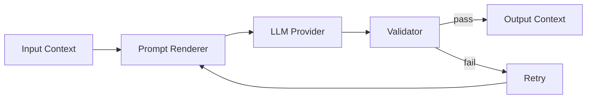

# Expert Specification

## 概述

Expert 是教学设计领域的专业角色。每个 Expert 对应一个特定的教学设计能力，拥有独立的 Prompt、输入输出规范和校验规则。

**重要：Expert 不是 Agent。** Expert 是领域能力的封装，不包含 Agent 的自主规划、工具调用和多轮对话能力。

## Expert 定义

```yaml
# experts/Curriculum_Expert.md (Markdown front matter)
---
id: curriculum-expert
name: 课程标准专家
role: curriculum-analyst
version: 1.0.0
description: 解析课程标准，提取内容要求与核心素养

input:
  - subject
  - grade
  - chapter
  - textbookVersion

output:
  - coursePosition
  - contentRequirements
  - coreCompetencies
  - academicQuality
  - teachingSuggestions

prompt: experts/Curriculum_Expert.md
model: default
temperature: 0.3
maxTokens: 2048

validation:
  required:
    - coursePosition
    - contentRequirements
    - coreCompetencies

constraints:
  - type: must_not
    description: "不得生成课堂活动"
  - type: must_not
    description: "不得设计评价方案"

dependencies: []
---
```

## 9 个核心 Expert

| Expert | Role | 输入来源 | 输出 | 禁止 |
|--------|------|---------|------|------|
| CurriculumExpert | `curriculum-analyst` | TeacherInput | 课标定位/核心素养/内容要求 | 课堂活动/评价 |
| TextbookExpert | `textbook-analyst` | CurriculumContext | 章节地位/前/后/重难点 | 课堂活动 |
| KnowledgeExpert | `knowledge-organizer` | Curriculum + Textbook | 知识图谱/工程案例/跨学科 | 教学目标 |
| StudentExpert | `student-analyst` | KnowledgeContext | 基础/困难/分层 | 教学活动 |
| GoalExpert | `goal-designer` | Curriculum + Knowledge + Student | 五维目标 | 课堂流程 |
| StrategyExpert | `strategy-designer` | Goal + Student + Knowledge | 教学方法/模式 | 具体活动 |
| ActivityExpert | `activity-designer` | Strategy + Goal + Student | EDP 任务序列 | 传统模板 |
| AssessmentExpert | `assessment-designer` | Goal + Activity | Rubric/评价工具 | 教学活动 |
| ResourceExpert | `resource-curator` | Activity + Assessment | 素材/PPT/板书 | 教学活动 |
| ReflectionExpert | `reflection-designer` | All prior | 反思框架/改进 | 修改输出 |
| ReviewExpert | `quality-reviewer` | All prior | 评分/建议/发布 | 修改输出 |

## Expert 与 Prompt 的关系

```
Expert (元数据)
    │
    ├── id / name / role        ← 身份定义
    ├── input / output          ← 数据契约
    ├── validation / constraints ← 质量保证
    └── prompt template          ← Prompt 文件（Markdown）
        │
        ├── Identity             ← 你是谁
        ├── Mission              ← 你的任务
        ├── Thinking Framework   ← 如何思考
        ├── Analysis Framework   ← 分析什么
        ├── Boundary             ← 不能做什么
        ├── Output Schema        ← 输出格式
        └── Quality Checklist    ← 质量自检
```

## Expert 执行流程



1. **读取 Context** — 从 Context Manager 获取输入数据
2. **渲染 Prompt** — 将 Context 变量注入 Prompt 模板
3. **调用 LLM** — 通过 Provider 执行推理
4. **校验输出** — 检查 required 字段和类型
5. **重试** — 校验失败最多重试 3 次
6. **写入 Context** — 将输出写入 Context Manager

## Expert 约束系统

每个 Expert 有两类约束：

```yaml
constraints:
  - type: must        # 必须做
    description: "必须使用最新版课程标准"
    severity: critical
    
  - type: must_not    # 禁止做
    description: "不得生成课堂活动"
    severity: critical
```

约束通过 Prompt 中的 Boundary 章节传递给 LLM，同时由 Validator 在输出校验阶段强制执行。
