# Teaching Design Skill Architecture

## 概述

Teaching Design Skill 是运行在 SkillRuntime 上的可复用教学设计技能。它将教学设计专业知识封装为可组合的 Capability，通过 Workflow 编排实现完整的教学设计自动化。

## 架构图

```mermaid
graph TD
    subgraph "Teacher Input"
        TI[教师输入]
    end

    subgraph "Teaching Design Skill"
        SM[Skill Manifest]
        SM --> CAP[Capabilities]
        SM --> WF[Workflows]
        SM --> EXP[Experts]
        SM --> PT[Prompt Templates]
        
        CAP --> C1[curriculum-analysis]
        CAP --> C2[lesson-design]
        CAP --> C3[objective-design]
        CAP --> C4[activity-design]
        CAP --> C5[assessment-design]
        CAP --> C6[resource-curation]
        CAP --> C7[reflection]
        
        WF --> W1[lesson-plan]
        WF --> W2[project-design]
        WF --> W3[engineering-design]
        
        EXP --> E1[CurriculumExpert]
        EXP --> E2[KnowledgeExpert]
        EXP --> E3[GoalExpert]
        EXP --> E4[StrategyExpert]
        EXP --> E5[ActivityExpert]
        EXP --> E6[AssessmentExpert]
        EXP --> E7[ResourceExpert]
        EXP --> E8[ReflectionExpert]
        EXP --> E9[ReviewExpert]
    end

    subgraph "SkillRuntime"
        SR[Runtime Services]
        SR --> CE[Context Engine]
        SR --> WE[Workflow Engine]
        SR --> EE[Expert Executor]
        SR --> PE[Prompt Engine]
        SR --> OE[Output Engine]
    end

    subgraph "Output"
        O1[Markdown]
        O2[DOCX]
        O3[PPTX]
        O4[JSON]
    end

    TI --> WE
    EXP --> EE
    EE --> PE
    WE --> OE
    OE --> O1
    OE --> O2
    OE --> O3
    OE --> O4
```



## 三层架构

| 层 | 组件 | 说明 |
|----|------|------|
| **Skill Package** | manifest / workflows / experts / prompts | 教学设计专业知识和流程 |
| **SkillRuntime** | Context / Workflow / Expert / Prompt / Output Engines | 运行时基础设施 |
| **Output** | Markdown / DOCX / PPTX / JSON | 多格式教学设计文档 |

## Skill 包结构

```
teaching-design/
├── skill.yaml                    # Skill 元数据
├── capabilities/                 # 能力定义
│   ├── curriculum-analysis.yaml
│   ├── lesson-design.yaml
│   ├── objective-design.yaml
│   └── activity-design.yaml
├── workflows/                    # 工作流定义
│   ├── lesson-plan.yaml
│   ├── project-design.yaml
│   └── engineering-design.yaml
├── experts/                      # Expert Prompt 文件
│   ├── Curriculum_Expert.md
│   ├── Knowledge_Expert.md
│   ├── Goal_Expert.md
│   ├── Strategy_Expert.md
│   ├── Activity_Expert.md
│   ├── Assessment_Expert.md
│   ├── Resource_Expert.md
│   ├── Reflection_Expert.md
│   └── Teaching_Review_Expert.md
├── prompts/                      # 共享 Prompt 模板
│   ├── system/
│   ├── user/
│   └── shared/
├── contexts/                     # Context Schema 定义
├── templates/                    # 输出模板
└── examples/                     # 示例教学设计
```

## Skill 与 Runtime 的关系

```
Teaching Design Skill (专业知识)
        │
        │  注册: capabilities / workflows / experts / prompts
        ▼
SkillRuntime (通用引擎)
        │
        │  提供: Context / Workflow / Expert / Prompt / Output
        ▼
执行 → 教学设计输出
```

Skill 只负责**定义**（知识、流程、模板），Runtime 负责**执行**（调度、生成、导出）。
