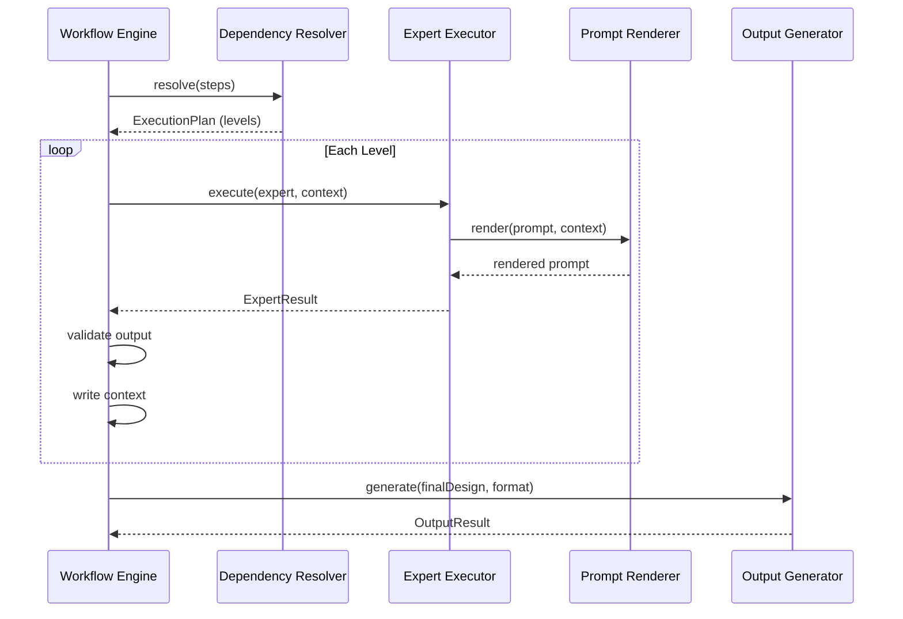

# Workflow Specification

## 概述

Workflow 定义了一个完整的教学设计执行流程。它将多个 Capability 按依赖关系编排为有向无环图（DAG），由 Workflow Engine 解析执行。

## Workflow 结构

```yaml
# workflows/lesson-plan.yaml
id: lesson-plan
name: 课时教学设计
description: 标准课时教学设计流程
version: 1.0.0

capabilities:
  - id: step-curriculum
    capability: curriculum-analysis
    depends_on: []
    
  - id: step-knowledge
    capability: knowledge-organization
    depends_on: [step-curriculum]
    
  - id: step-student
    capability: student-analysis
    depends_on: [step-knowledge]
    
  - id: step-objective
    capability: objective-design
    depends_on: [step-curriculum, step-knowledge, step-student]
    
  - id: step-strategy
    capability: strategy-design
    depends_on: [step-objective, step-student]
    
  - id: step-activity
    capability: activity-design
    depends_on: [step-strategy, step-objective]
    
  - id: step-assessment
    capability: assessment-design
    depends_on: [step-objective, step-activity]
    
  - id: step-resource
    capability: resource-curation
    depends_on: [step-activity]
    
  - id: step-reflection
    capability: reflection
    depends_on: [step-curriculum, step-knowledge, step-student, step-objective, step-strategy, step-activity, step-assessment]
    
  - id: step-review
    capability: quality-review
    depends_on: [step-curriculum, step-knowledge, step-student, step-objective, step-strategy, step-activity, step-assessment, step-reflection]

output:
  formats: [markdown, json, docx, pptx]
  template: templates/lesson-plan.md

failure:
  strategy: abort_on_critical
  critical_steps: [step-curriculum, step-objective]
```

## 三种标准 Workflow

### 1. lesson-plan（课时教学设计）

```
curriculum → knowledge → student → objective → strategy → activity → assessment → resource → reflection → review
```

### 2. project-design（项目式学习）

```
curriculum → knowledge → student → objective → engineering-strategy → activity(EDP) → engineering-assessment → resource → reflection → review
```

### 3. engineering-design（工程实践）

```
engineering-context → requirements → constraints → ideation → selection → representation → prototype → testing → optimization → presentation → review
```

## 执行流程



## 失败策略

| 策略 | 行为 | 适用 |
|------|------|------|
| `abort` | 任意失败停止 | 开发调试 |
| `abort_on_critical` | 仅关键步骤失败停止 | 生产环境 |
| `continue` | 记录失败继续 | 可选步骤 |
| `skip` | 跳过失败步骤 | 可选能力 |
